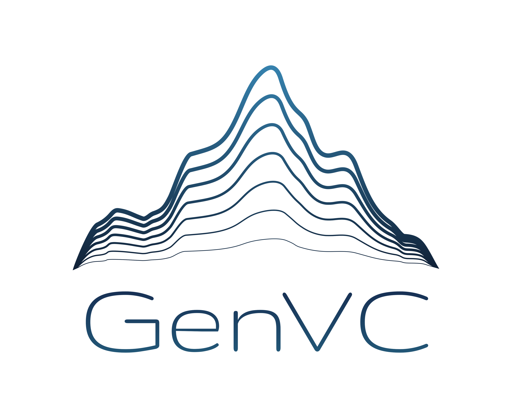
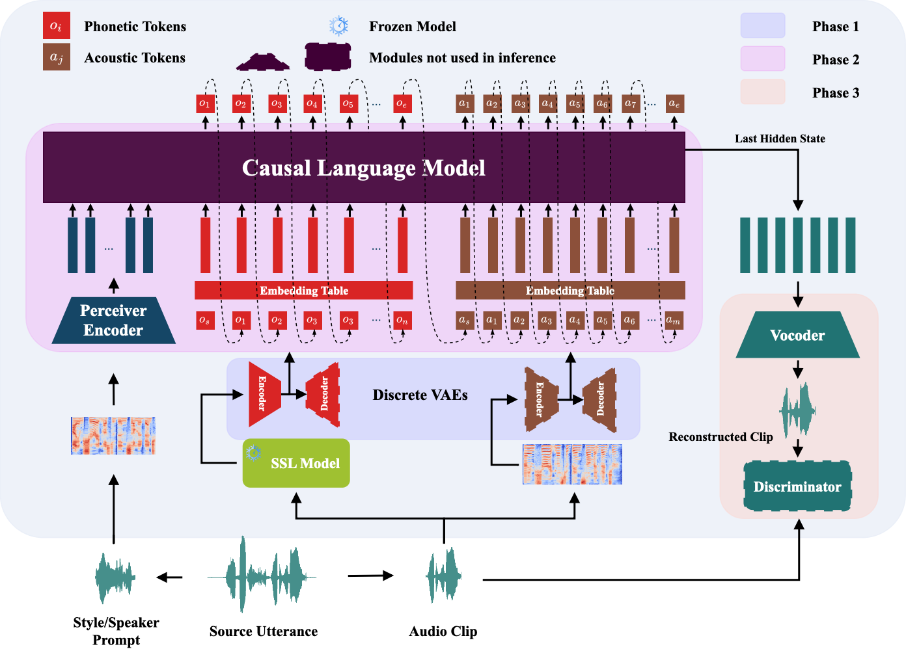

<div align="center">
   
</div>

<p align="center"><strong style="font-size: 22px;">
Self-Supervised LM-Based Zero-Shot Voice Conversion
</strong>
</p>

<p align="center">
♠︎ <a href="https://huggingface.co/ZexinCai/GenVC">Model</a>   | ♣︎ <a href="https://github.com/caizexin/GenVC">Github</a> 
|  ♥︎ <a href="https://arxiv.org/abs/2502.04519">Paper</a> | ♦︎ <a href="https://caizexin.github.io/GenVC/index.html">Demo</a>
</p>

GenVC is an open-source, language model-based zero-shot voice conversion system that leverages self-supervised training and supports streaming voice conversion.
<!-- --- -->

## Approach
<p align="center">
    
</p>


## Features

✅ **Zero-shot Voice Conversion** 

✅ **Streaming VC**

✅ **Self-supervised Training**

## Setup
Create a new conda environment and install the required packages:
```sh
# Create a new Conda environment
conda create -n genVC python=3.10

# Activate the environment
conda activate genVC

# Install necessary dependencies
pip install pip==20.3.4
pip install transformers==4.33.0
pip install fairseq
pip install torch==2.3.0 torchaudio==2.3.0

# Install additional requirements
pip install -r requirements.txt
```
We used Python 3.10, Torch 2.3, and Transformers 4.33 to train and test our models. However, the codebase is expected to be compatible with Torch versions below 2.6 and other versions of the Transformers package. Streaming inference may not be compatible with some higher versions of Transformers. The specified installation ensures that users can successfully install Fairseq without encountering [issues](https://github.com/facebookresearch/fairseq/issues/5012). 
## Inference
NOTE: **top_k** is one of the key hyperparameters for inference, and you can adjust it using `--top_k` to achieve better results. For streaming inference, greedy decoding is recommended; you can set top_k to 1. 
### Available models

| Model | Training Set |
| :--------: | :--------: |
| [`GenVC_small`](https://huggingface.co/ZexinCai/GenVC/blob/main/pre_trained/GenVC_small.pth) | [LibriTTS](https://openslr.org/60/) |
| [`GenVC_large`](https://huggingface.co/ZexinCai/GenVC/blob/main/pre_trained/GenVC_large.pth) | [LibriTTS](https://openslr.org/60/), [MLS](https://www.openslr.org/94/), [Common Voice](https://commonvoice.mozilla.org/en)  |

We recommend downloading the model and placing it in the `pre_trained/` directory.

### Non-streaming inference
```sh
python infer.py --model_path pre_trained/GenVC_small.pth --src_wav samples/EF4_ENG_0112_1.wav --ref_audio samples/EM1_ENG_0037_1.wav --output_path samples/converted.wav
```
### Streaming inference
```sh
python infer.py --model_path pre_trained/GenVC_small.pth --src_wav samples/EF4_ENG_0112_1.wav --ref_audio samples/EM1_ENG_0037_1.wav --output_path samples/converted.wav --streaming
```
#### Latency and RTF
We evaluated the latency and real-time factor (processed time / audio length) of our model on three different GPUs, with the results presented in the table below. The streaming experiment was conducted using 1-second chunk processing, and latency was measured as the time taken for the model to generate the first audio signal after receiving an input signal. In a practical setting, the actual latency would be the sum of the audio length (1 second) and the processing latency, where the audio length represents the time required for a person to produce the speech.

| GPU Type  |       |    Latency (ms)      |         |      |        |    RTF       |         |
| :--------: | :--------: | :--------: | :--------: | :--------: | :--------: | :--------: | :--------: |
|           | **Avg.**           | **Min** | **Max** |      | **Avg.**    | **Min** | **Max** |
| H100      | **95.2**           | 94.5    | 96.4    |      | **0.28**    | 0.03    | 0.44    |
| A100      | 129.7              | 123.9   | 148.4   |      | 0.38        | 0.04    | 0.73    |
| 1080-TI   | 183.9              | 177.5   | 193.9   |      | 0.57        | 0.08    | 1.11    |


## Training
We highly recommend using Weights & Biases ([wandb](https://wandb.ai/site/)) to track training progress. Please refer to our training history as a reference for training your own model. 
### Dataset preparation
Download the [LibriTTS](https://openslr.org/60/) and place it in the `data/` folder. Use our prepared metadata located in `metafiles/libritts/`. Each line in the metafile follows the format: `utterance_path|spk`.

### Tokenizer training
We also provide [pretrained tokenizers](https://huggingface.co/ZexinCai/GenVC/blob/main/pre_trained/).

NOTE: Modify the configurations in `train_*_dvae.py` if necessary.
```sh
CUDA_VISIBLE_DEVICES=0 python train_audio_dvae.py
```
For phonetic tokenizer training, please download the [ContentVec](https://ibm.box.com/s/nv35hsry0v2y595etzysgnn2amsxxb0u) model and save it as pre_trained/contentVec.pt. If you’ve already downloaded the [`pre_trained`](https://huggingface.co/ZexinCai/GenVC/tree/main/pre_trained) directory from Hugging Face, no further download is necessary.
```sh
CUDA_VISIBLE_DEVICES=0 python train_content_dvae.py
```
### GenVC training
```sh
CUDA_VISIBLE_DEVICES=0 python train_genVC.py
```
### Vocoder training
```sh
CUDA_VISIBLE_DEVICES=0 python train_vocoder.py
```
## Future updates
☑️ **Multi-GPU Training**

☑️ **Causal Neural Vocoder**

☑️ **Multilingual VC**

## Impact Statement
While our work holds significant promise, it also carries potential societal implications that warrant consideration. GenVC is a voice conversion system capable of transforming source speech into desired voices. While this technology has valuable applications, such as enhancing privacy by anonymizing voices and enabling accessibility for individuals with speech impairments, it is also presents ethical challenges. Specifically, the ability to convincingly replicate voices can be misused to create audio deepfakes, which may be employed for malicious purposes, such as identity theft, fraud, and the spread of misinformation.

To mitigate these risks, we strongly advocate for the responsible and ethical use of voice conversion technologies. Researchers, developers, and users must comply with relevant laws and guidelines, ensuring that these systems are used exclusively for legitimate and beneficial applications. Trans-
parency, informed consent, and robust safeguards should be prioritized to prevent misuse and protect individuals’ rights and privacy.

## Acknowledgements
- [Coqui-AI/Trainer](https://github.com/coqui-ai/Trainer) for the PyTorch model trainer
- [Tortoise-TTS](https://github.com/neonbjb/tortoise-tts) and [XTTS](https://github.com/coqui-ai/TTS) for the LLM backbone
- [Amphion](https://github.com/open-mmlab/Amphion) for providing some of the vocoder codes

